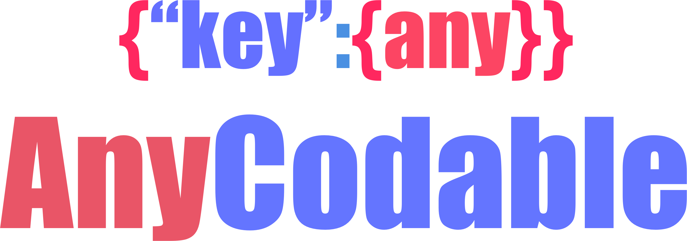

<p align="center" >
  
</p>

[](https://cocoapods.org/pods/AnyCodable)
[](http://cocoapods.org/pods/AnyCodable)
[](https://www.apache.org/licenses/LICENSE-2.0.html)
[](https://travis-ci.org/levantAJ/AnyCodable)

# AnyCodable
This library to facilitate decode and encode `[String: Any]`, [Any]

## Requirements

- iOS 8.0 or later
- Xcode 10.0 or later

## Installation
There is a way to use AnyCodable in your project:

- using CocoaPods

### Installation with CocoaPods

```
pod 'AnyCodable', '1.0'
```
### Build Project

At this point your workspace should build without error. If you are having problem, post to the Issue and the
community can help you solve it.

## How To Use

```swift
import AnyCodable

struct MockCodableObject: Codable {
    var dict: [String: Any]
    var array: [Any]
    var optionalDict: [String: Any]?
    var optionalArray: [Any]?

    enum CodingKeys: String, CodingKey {
        case dict
        case array
        case optionalDict
        case optionalArray
    }

    init(from decoder: Decoder) throws {
        let values = try decoder.container(keyedBy: CodingKeys.self)
        dict = try values.decode([String: Any].self, forKey: .dict)
        array = try values.decode([Any].self, forKey: .array)
        optionalDict = try values.decodeIfPresent([String: Any].self, forKey: .optionalDict)
        optionalArray = try values.decodeIfPresent([Any].self, forKey: .optionalArray)
    }

    func encode(to encoder: Encoder) throws {
        var container = encoder.container(keyedBy: CodingKeys.self)
        try container.encode(dict, forKey: .dict)
        try container.encode(array, forKey: .array)
        try container.encodeIfPresent(optionalDict, forKey: .optionalDict)
        try container.encodeIfPresent(optionalArray, forKey: .optionalArray)
    }
}

```

## Author
- [Tai Le](https://github.com/levantAJ)

## Communication
- If you **found a bug**, open an issue.
- If you **have a feature request**, open an issue.
- If you **want to contribute**, submit a pull request.

## Licenses

All source code is licensed under the [MIT License](https://raw.githubusercontent.com/levantAJ/AnyCodable/master/LICENSE).
